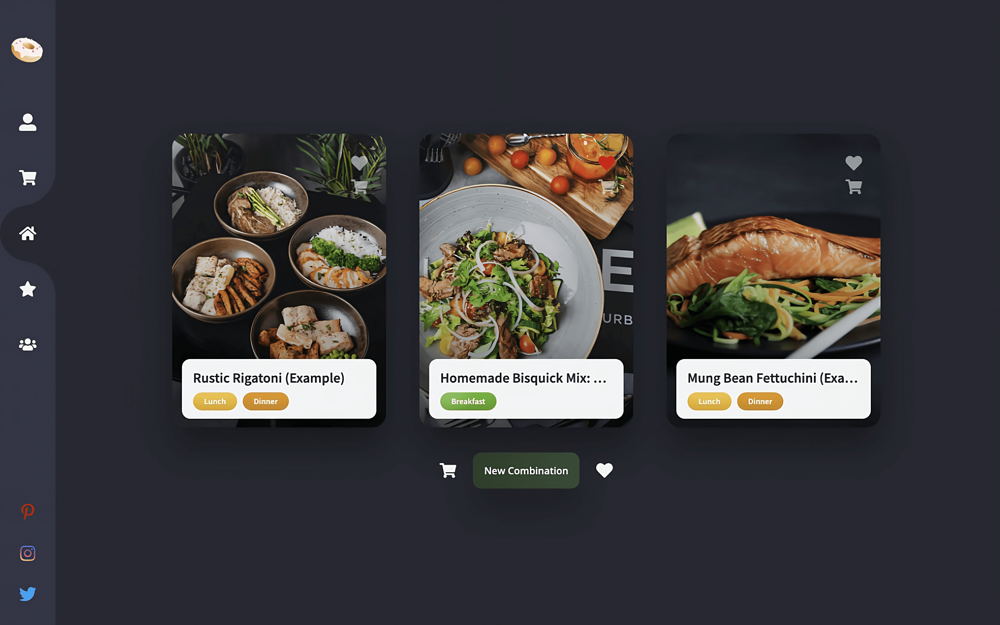

# Random Meal Website Readme

## Description
Say hello to an effortless way of deciding what to eat every day. The Random Meal website provides a convenient way to plan your meals and simplify cooking. You can generate a personalised daily meal plan, and if you need inspiration, use our random meal generator. Keep track of your favourite meals and store them for future use, and always have the right ingredients on hand with the shopping list feature.

The website is available at https://randommeal-megglebande.netlify.app/.

The website was created using React.js, TailwindCSS and the Spoonacular API. For more information about the website, how it was built, and to see additional projects, please visit my personal website at https://megglebande.netlify.app/.

## Getting Started
To start the project, follow these steps:
1. Download the project as a zip file
2. Open the zip
3. Open the terminal in folder
4. Run `npm start`

## Bug Reporting
If you encounter any bugs or have recommendations for improvements, please create an issue on the Github repository.

## Contact Information
If you have any inquiries, please send an email to megglebande@web.de.